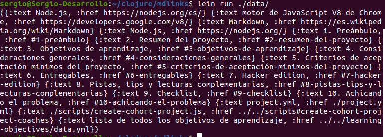

# mardown-links-extractor

A CLI which extracts and validates links from markdown files in a directory a subdirectory.

`md-links <path-to-file> [options]`

If we pass the `--validate` option, the module must make an HTTP request to
find out if the link works or not. If the link results in a redirect to a
URL that responds ok, then we will consider the link as ok.

## Implementation details

[commonmark-java](https://github.com/commonmark/commonmark-java) library is used for parsing the markdown files.
This library provides [AbstractVisitor Class](https://www.javadoc.io/doc/org.commonmark/commonmark/latest/org/commonmark/node/AbstractVisitor.html) which is extended in clojure by [LinkVisitor](./src/mkdlinks/visitors/LinkVisitor.clj)

Each markdown file is processed in a thread using a clojure future. 
Each link is validated in a thread using a clojure future.
In both cases, clojure promises are used to provide result when a operation finished.

## Examples

### Help message

### Process a single file and validate links

### Process a single file and no validate liks

### Process a directory and validate links

### Process a directory and no validate links

    

